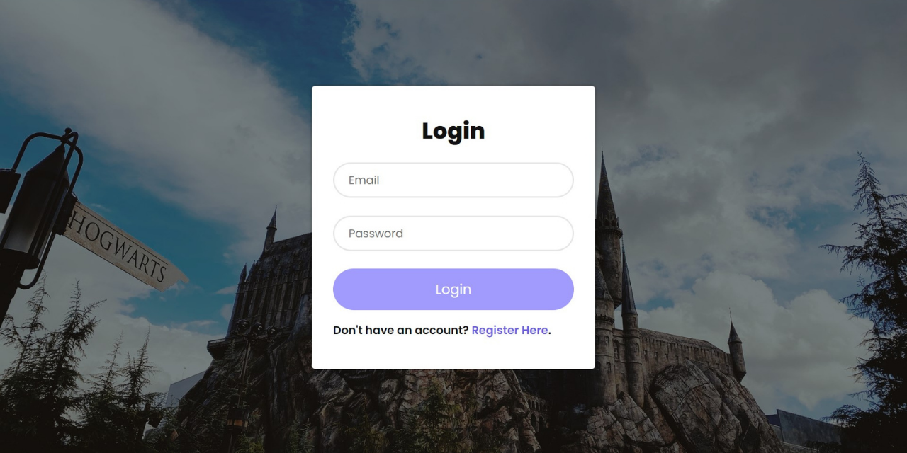

# User Login and Register Form using PHP Programming Language 
This is a project of the Server-Side Internet Programming course. This project contains a login and register form using PHP programming language for the user to access the web that I created before and all the users' account data are saved in the database. I linked this login form with my simple web with the 'Harry Potter: Hogwarts' theme that was created before this project so when the user gets login with the right account it will show the previous web that I created and to open this login page, you may run the index.php file but to access this web is still using localhost.

